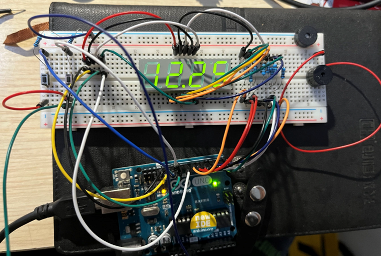

# 7-Segment-Display-Project
## Introduction

The idea of this project is by setting up a simple and interesting projects for the upcoming Engineers, to give them a taster session of how its feel like to do electronics and become a Electronic Engineer. The course contains both the hardware and the software part, as well as the physics learned in the A-level textbook. We will cover the working mechanism of Light Emitting Diode (LED), basic Arduino knowledge including how to control the Input and Output (I/O) of the Arduino, how does the timer works inside the Arduino and what is Interrupt. At the end of the outreach program, students will be able to: 

- Understand the basis of Arduino programming and the working mechanisms of 7-segment display. 

- Develop problem-solving abilities and the ability to turn the knowledge from the book to the real world. 

- Develop the ability to work and manage an Engineering project as well as collaborating with other people. 

After covering all of these, students can do some of their owm projects and take them home. Some interesting project ideas includes:

- Displaying current date or time
- Displaying an important day (for example, student's own birthday)
- Attaching the display to a sensor to display the sensor reading (for example, read the temperature by connecting to a thermistor)

## Arrangement of the course

- Week 1: Introduction to Arduino, understanding basic electronics and initial programming. The students get familiarized with the Arduino environment and its basic functions. 

- Week 2: Introduction to LED and buzzer. Students learn the basic principles behind LEDs and buzzers and how to use delay and other time-related functions. 

- Week 3: Introduction to thermistors, understanding analog I/O operations and how to read temperature changes. The serial communication of Arduino is also introduced.  

- Week 4: Introduction to the working principles of a 4-digit 7-segment display 

- Week 5: Combine all the lessons and create a complete thermistor-based project that interacts with a 4-digit 7-segment display

## Time schedule

### Week 1

**Objective:** Implement the experiment “LED blink” and “Buzzer Beep”, then explain the principles behind the code and components. 

**Theory session:** 
1.	How does LED work by showing an interesting animation
2.	How to connect LED (cathode and anode) Why there is a difference between them.
3.	Explain How delay () function works in audrino and how does it connect with time module.
4.	Explain the difference between delay (), millis() and interrupt
5.	How does a buzzer work?
6.	What are the differences between analogue and digital signal?

**Practical Session:**
1. Make an alarm (flash the LED and beep the buzzer), or maybe a police car.

### Week 2

**Objective:** Understand what is Arduino and go through the preparation for the following experiment

**Theory session:** In this session, we will give a brief introduction of Arduino, the paraphirals used in this project and basic Arduino programming functions. That includes the following:

1. What is a microprocesser and what is an Arduino
2. The Input and Output (I/O) pins of the Arduino, how does it works
   1. Special pins in the Arduino, e.g. PWM pins and Analog Input pins
   2. How much current they can drive
3. Basic C programming in Arduino
   1. Loops and functions, what is the difference between`setup()` and `loop()` ?
   2. Arduino functions used in this project, including the followings:
      1. digitalWrite();
      2. analogWrite();
      3. delay(); and millis();
      4. interrupt();
4. Electronic components that are used in this project:
   1. breadboard
   2. resistor
   3. LED display (common Anode)
   4. buzzers
   5. push buttons
   6. jump wires

**Practical session:**

 1. Install Arduino IDE and make sure Arduino connects to students' laptop. Alternatively, students can use the lab computer
2. First Arduino program: LED blink sketch
3. Building simulation on [TinkerCAD](www.tinkercad.com) website

### Week 3

**Objective:** Become familiar with the concept of thermistor and how does serial communication work for the temperature measurement

**Theory session:**
1. How a thermistor works
2. What is a voltage divider, how to “read” change in resistance.
3. Serial IO of the Arduino, how to display the temperature input by reading the value from Serial monitor.

**Practical session**
1. Making an appropriate circuit containing the thermistor and resistor that can be used to measure the temperature.
2. Display the relative temperature change on Serial monitor.
3. Making a system when the temperature is below the set temperature, the green LED will light up. When the temperature is above, the red LED lights up.

### Week 4

**Objective:** Displaying numbers onto the 4-digit 7 segment display

**Theory session:** 
1.	How to control the LED array by matrix scanning
2.	Control multiple LEDs with few IO pins by multiplexing
3.	How to find out the individual pins of the LED by either
    1.	Trial and Error
    2.	Reading the datasheet

**Practical session:**
1. Making the 4 Digit 7 Segment display to display numbers from 0 to 9
2. Display certain time, and students’ own birthday (DD/MM)

### Week 5
**Objective:** Combine the knowledge that has learned so far and make a thermistor that displays the measured temperature on a 4-digit 7 segment display.

**Practical session:**
1. Display the measured temperature on the 4-digit 7 segment display.
2. When temperature exceeds the user set temperature, the red LED starts flashing and the buzzer beeps.
3. Students try to integrate the system by themselves.

### Notice
When updating to the Arduino, please **DO NOT** connect the pin 0 and pin 1 of the Arduino, this will cause difficulties while uploading the code to the Arduino
